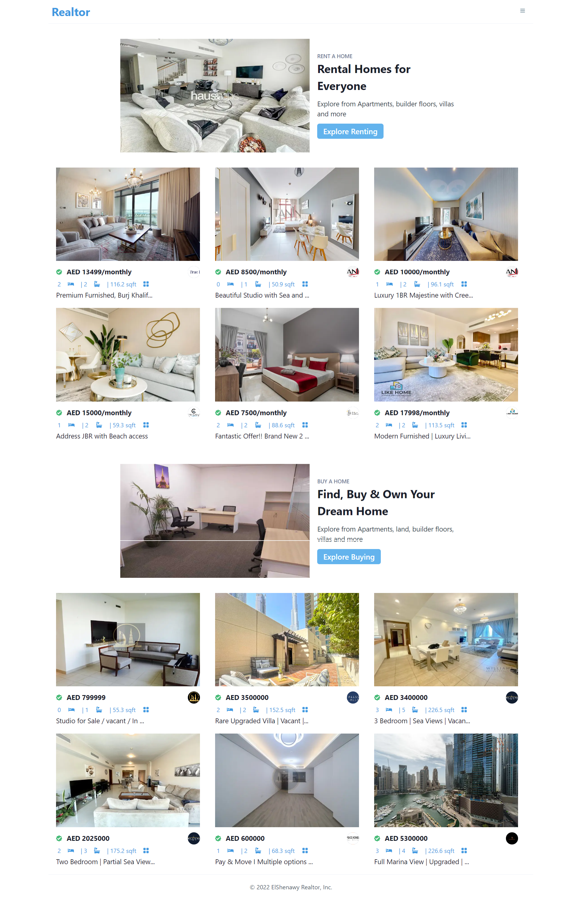
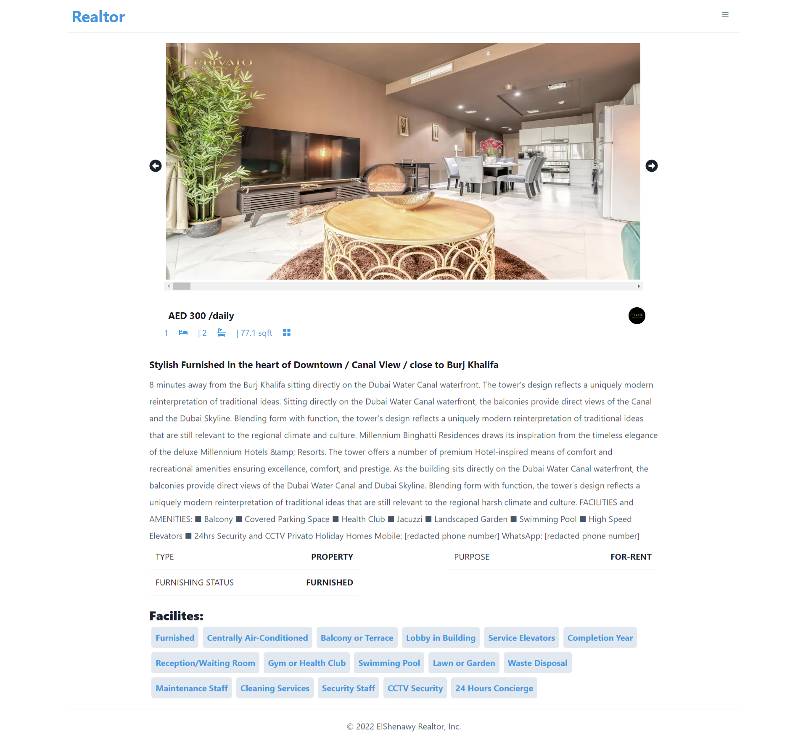

# Relator

## Description

- Realtor is a Real Estate website application where you can buy or rent properties in United Arab Emirates , the data is 100% real.

## Table of contents

- [Overview](#overview)
- [Screenshot](#screenshot)
- [Links](#links)
- [My process](#my-process)
- [Built with](#built-with)
- [Author](#author)

## Overview

- Realtor is an amazing Real Estate
  Application with rental homes and for-sale properties, advanced property filtering, property details page with an image carousel, and much more.

### Screenshot

### Links

- Live Site URL: [Realtor](https://elshenawy-real-estate.vercel.app/)

## My process

- to build a Real Estate Website. with best and most modern one using React, Next.js, chakra-ui for styling, and data comes from RapidAPI

### Built with

- Mobile-first workflow
- [Chakra-ui ](https://chakra-ui.com/) - CSS framework
- [React](https://reactjs.org/) - JS library
- [Next.js](https://nextjs.org/) - React framework

## Author

- GitHub - [Muhammad Ali El-Shenawy](https://github.com/Muhammad-ElShenawy)
- Instagram - [@Muhammad Ali El-Shenawy](https://www.instagram.com/muhammad_ali_elshenawy/)
- LinkedIn - [@Muhammad Ali El-Shenawy](https://www.linkedin.com/feed/)
- Twitter - [@Muhammad Ali El-Shenawy](https://twitter.com/mohamedgk5)
